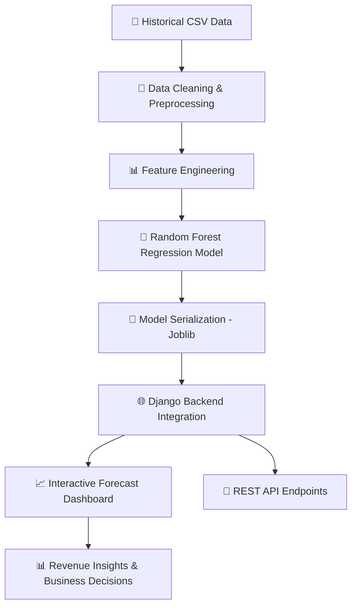
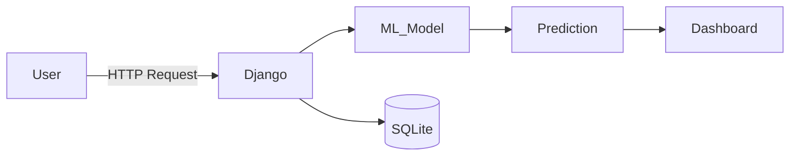

<div align="center">

# 🏥 DrSheba Commission Forecasting Revenue  
### 📊 AI-Powered Healthcare Revenue Intelligence System  
### 🌐 Digital Healthcare Service Platform  


</div>

---

# 🔷 Project Overview

**DrSheba Commission Forecasting Revenue** is a Django-based machine learning web application that forecasts commission earnings for a digital healthcare service platform.

The system leverages historical transaction data and applies a **Random Forest Regression model** to generate accurate, data-driven revenue predictions.

---

# 🔄 End-to-End System Flow



---

# 🏗 Application Architecture



---

# 🎯 Core Functionalities

## 🟢 Data Engineering
- CSV ingestion pipeline  
- Data preprocessing & transformation  
- Feature extraction  

## 🔵 Machine Learning
- Random Forest Regression forecasting  
- Historical trend learning  
- Commission prediction engine  
- Automated retraining via Django management commands  

## 🟣 Web Application
- Django 4.2 backend  
- Interactive forecast dashboard  
- REST-based prediction endpoints  

---

# 🛠 Technology Stack

| Layer | Technology |
|-------|------------|
| Backend | Django 4.2 |
| Language | Python 3.9 |
| ML Model | Random Forest (Scikit-learn) |
| Data Processing | Pandas |
| Model Storage | Joblib |
| Database | SQLite |

---

# 📦 Installation & Setup

```bash
# Clone repository
git clone https://github.com/Hellopapri/your-repository-name.git

# Navigate to project folder
cd DrSheba-commission-forecasting-revenue

# Create virtual environment
python -m venv .venv

# Activate environment (Mac/Linux)
source .venv/bin/activate

# Install dependencies
pip install -r requirements.txt

# Run migrations
python manage.py migrate

# Train ML model
python manage.py train_commission_model

# Start server
python manage.py runserver
```

After running the server, open your browser and go to:

👉 http://127.0.0.1:8000/forecasting/dashboard/

---

# 📸 Screenshots

### 📊 Dashboard


### 📈 Forecast Result


---

# 🚀 Business Value

✔ Enables data-driven financial forecasting  
✔ Supports strategic commission planning  
✔ Improves revenue prediction accuracy  
✔ Bridges healthcare operations with AI intelligence  

---

# 👩‍💻 Author & Mentor

👩‍💻 **Author**: Papri Majumder  
GitHub: https://github.com/Hellopapri  

👤 **Mentor**:  
[Nusrat Jahan](https://github.com/Nusrat-96)  

---

# 📜 License

Licensed under the MIT License.

---

<div align="center">

### ⭐ If you like this project, consider giving it a star!

</div>
